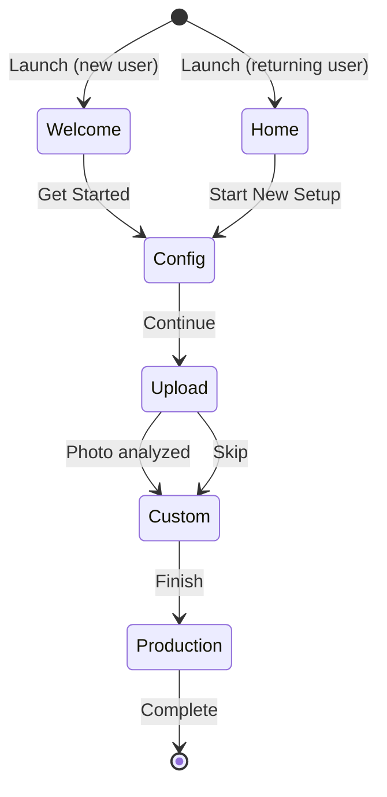
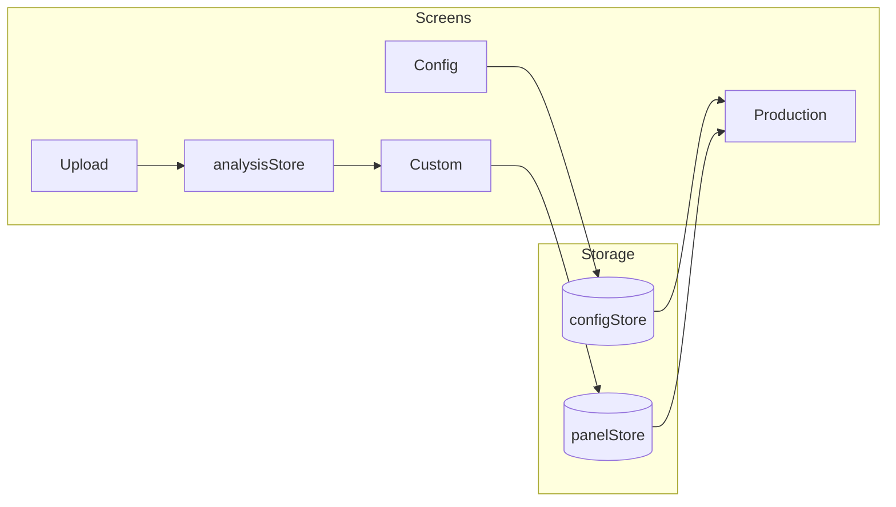

# CLAUDE.md

This file provides guidance to Claude Code (claude.ai/code) when working with code in this repository.

## Commands

```bash
# Install dependencies
bun install

# Start Expo development server
bun start

# Run on specific platforms
bun ios      # iOS simulator (opens dev build)
bun android  # Android emulator (opens dev build)
bun web      # Web browser

# Lint
bun run lint

# Type check
./node_modules/.bin/tsc --noEmit

# Maestro E2E tests
bun run test:maestro
```

**⚠️ IMPORTANT - Development Build Workflow:**

This project uses **development builds** (Expo dev client), NOT bare `npx expo run:ios` builds.

- **Local development**: Start dev server (`bun start`), open development build on simulator
- **DO NOT run**: `npx expo run:ios`, `npx expo run:android`, or `eas build --local` for local dev

## Architecture

This is an Expo Router v55 preview app for creating solar panel array layouts. Uses React Native New Architecture with React Compiler enabled.

### Key Technologies

- **Expo Router v55 preview** - `Stack.Screen`, `Stack.Toolbar`, `Link.Trigger` with `withAppleZoom`
- **React Native Reanimated** - SharedValues for smooth 60fps animations
- **React Native Gesture Handler** - Pan and tap gestures for canvas interactions
- **expo-image** - Optimized image rendering
- **expo-haptics** - iOS haptic feedback on interactions
- **expo-image-picker** - Camera capture and gallery selection with permission handling
- **@shopify/react-native-skia** - High-performance 2D canvas for solar panel layout
- **@ai-sdk/amazon-bedrock** - Claude on AWS Bedrock for image analysis (no AWS SDK dependency)
- **expo-image-manipulator** - Client-side image resize before upload
- **@expo/ui/swift-ui** - Native SwiftUI components (Form, Section, List, BottomSheet)
- **expo-sqlite/kv-store** - Synchronous key-value storage for configuration

## Wizard Flow

The app guides users through a 3-step wizard with a progress indicator:



### Wizard Navigation Pattern

| Screen | Primary Action | Secondary Action |
|--------|---------------|------------------|
| Welcome | "Get Started" button | "I already have a layout" link |
| Config | "Continue" button (bottom) | Back button |
| Upload | Take Photo / Gallery | "Skip, create manually" link |
| Custom | "Finish" in toolbar | Back button |

### Steps

| Step | Screen | Purpose |
|------|--------|---------|
| 1 | Config | Configure micro-inverters (serial numbers, efficiency) |
| 2 | Upload | Optional: AI analyzes photo to generate layout |
| 3 | Custom | Edit layout, link panels to inverters |
| — | Production | View-only: real-time wattage per panel (post-wizard) |

### WizardProgress Component

`src/components/WizardProgress.tsx` displays a 3-step indicator:
- **Configure** → **Photo** → **Layout**
- Current step: filled purple circle
- Completed steps: purple circle with checkmark
- Future steps: gray outline
- Connected by lines (purple for completed, gray for pending)

### Data Flow



### Project Structure

```
src/
├── app/                    # Expo Router file-based routes
│   ├── _layout.tsx         # Root layout with PanelsProvider
│   ├── index.tsx           # Welcome screen / Home with option cards
│   ├── config.tsx          # Step 1: Configuration (SwiftUI Form)
│   ├── upload.tsx          # Step 2: Upload & AI analysis
│   ├── custom.tsx          # Step 3: Canvas editor with toolbar
│   ├── production.tsx      # Production monitor (real-time wattage)
│   ├── panel-details.tsx   # Form sheet: View/link panel to inverter
│   └── api/
│       └── analyze+api.ts  # Bedrock API route (Claude vision)
├── components/
│   ├── OptionCard.tsx      # Home screen cards
│   ├── ImagePreview.tsx    # Image preview
│   ├── PermissionModal.tsx # Camera permission UI
│   ├── ProcessingOverlay.tsx # Fibonacci shader + shimmer text
│   ├── ProductionCanvas.tsx # Read-only canvas for production
│   ├── ProductionPanel.tsx # Panel with wattage display
│   ├── SolarPanel.tsx      # Skia panel with rotation
│   ├── SolarPanelCanvas.tsx # Main canvas + gestures
│   ├── WizardProgress.tsx  # 3-step progress indicator
│   └── ZoomControls.tsx    # Floating zoom +/- controls
├── hooks/
│   ├── useConfigStore.ts   # Config store hook (inverters, wattage, wizard)
│   ├── useImagePicker.ts   # Camera/gallery hook
│   └── usePanelsManager.ts # Panel state management
└── utils/
    ├── analysisStore.ts    # Module-level store for analysis results
    ├── collision.ts        # AABB collision detection
    ├── configStore.ts      # Persistent config (expo-sqlite/kv-store)
    ├── gridSnap.ts         # Grid snap utilities
    ├── imageResize.ts      # Client-side image resize for upload
    ├── panelUtils.ts       # Panel helpers
    └── zoomConstants.ts    # Zoom level definitions
```

Path alias: `@/*` maps to `./src/*`

## Canvas System

### Core Components

**SolarPanelCanvas** (`src/components/SolarPanelCanvas.tsx`)
- Skia Canvas wrapped in GestureDetector
- Handles both panel dragging and viewport panning
- Converts screen coordinates to world coordinates for hit testing
- Applies viewport transform to all panel rendering

**SolarPanel** (`src/components/SolarPanel.tsx`)
- Renders a single panel with Skia primitives
- Supports rotation (0° portrait, 90° landscape)
- Shows amber border when selected

**usePanelsManager** (`src/hooks/usePanelsManager.ts`)
- Manages panel array state with SharedValues for x, y, rotation
- `addPanel()` - finds free position using spiral search
- `removePanel()` - deletes panel
- `rotatePanel()` - toggles 0°↔90° with smart repositioning
- `bringToFront()` - moves selected panel to top of z-order

### Key Constants

```typescript
// Panel dimensions (src/utils/panelUtils.ts)
PANEL_WIDTH = 60    // Portrait width
PANEL_HEIGHT = 120  // Portrait height

// Grid (src/utils/gridSnap.ts)
GRID_SIZE = 30      // Snap grid in pixels

// Collision (src/utils/collision.ts)
PANEL_GAP = 8       // Minimum gap between panels

// Zoom levels (src/utils/zoomConstants.ts)
ZOOM_LEVELS = [1.0, 0.66, 0.4]  // Scale factors (most zoomed in → most zoomed out)
```

### Gesture Behavior

1. **Tap on panel** → Select panel, show rotate/delete buttons
2. **Tap on empty space** → Deselect panel
3. **Drag panel** → Move with collision prevention, snap on release
4. **Drag empty space** → Pan the infinite canvas viewport

### Zoom Controls

Both Custom and Production screens include a floating zoom control in the bottom-right corner:

- **3 zoom levels**: 1.0× (default), 0.66×, 0.4×
- **UI**: Plus/minus buttons with horizontal line indicators showing active level
- **Transform**: Scale centered on canvas center for intuitive zoom behavior
- **Coordinate conversion**: Screen→world coordinates account for scale factor
- **Consistent feel**: Pan and drag gestures divided by scale for uniform speed at all zoom levels

**ZoomControls** (`src/components/ZoomControls.tsx`)
- Floating pill-shaped control with haptic feedback
- Active zoom level shown as dark line, inactive as light gray

### Collision Detection

- AABB (Axis-Aligned Bounding Box) collision
- 4px minimum gap enforced between panels
- Collision checked during drag (blocks invalid moves)
- Collision checked on grid snap (prevents snap into collision)
- Rotation checks for valid position, moves panel if needed

### Worklet Functions

Functions marked with `"worklet"` run on the UI thread:
- `rectsOverlap()` - collision check
- `collidesWithAny()` - batch collision check
- `snapToGrid()` - grid alignment
- `getPanelDimensions()` - width/height based on rotation
- `hitTestPanels()` - find panel at touch point

## Navigation & Toolbar

### Stack.Toolbar (Expo Router v55)

```tsx
// Bottom toolbar with conditional buttons
<Stack.Toolbar placement="bottom">
  <Stack.Toolbar.Button icon="plus" onPress={addPanel} />
  {selectedId && (
    <>
      <Stack.Toolbar.Button icon="rotate.right" onPress={rotate} />
      <Stack.Toolbar.Button icon="trash" onPress={delete} />
    </>
  )}
</Stack.Toolbar>

// Right header button
<Stack.Toolbar placement="right">
  <Stack.Toolbar.Button icon="location" onPress={snapToOrigin} />
</Stack.Toolbar>
```

### SF Symbols

Toolbar buttons use iOS SF Symbols for icons:
- `plus` - Add panel
- `rotate.right` - Rotate panel
- `trash` - Delete panel
- `location` - Snap to first panel

## API Route — Image Analysis

### `src/app/api/analyze+api.ts`

Expo API route that sends an uploaded photo to Claude Sonnet 4.5 on AWS Bedrock for vision analysis.

- **Model**: `us.anthropic.claude-sonnet-4-5-20250929-v1:0` (cross-region inference profile)
- **SDK**: `@ai-sdk/amazon-bedrock` v4+ (no AWS SDK dependency, works on Cloudflare Workers)
- **Input**: Base64-encoded JPEG image (resized client-side to max 1568px long edge)
- **Output**: JSON with `panels[]` array containing `{ x, y, width, height, rotation, label }`

### Environment Variables

Required for the API route (set in `.env` for local dev, EAS Secrets for production):

| Variable | Description |
|----------|-------------|
| `AWS_ACCESS_KEY_ID` | IAM user access key |
| `AWS_SECRET_ACCESS_KEY` | IAM user secret key |
| `AWS_REGION` | AWS region (e.g. `us-east-1`) |

### Local Development

```bash
# Start API routes + native app
npx expo serve

# Test API route directly
curl -X POST http://localhost:8081/api/analyze \
  -H "Content-Type: application/json" \
  -d '{"image":"<base64>","mimeType":"image/jpeg"}'
```

### Infrastructure

Terraform config in `terraform/` creates an IAM user with minimal `bedrock:InvokeModel` permissions. See `terraform/README.md` for setup instructions.

## Maestro Tests

E2E tests live in `.maestro/` directory. Current coverage:
- Smoke test: app launch, home screen, navigation to upload/custom screens

**Run locally:**

**IMPORTANT**: This project uses development builds. DO NOT use `npx expo run:ios` or `eas build --local` for local development.

```bash
# Install Maestro (one-time setup)
curl -Ls "https://get.maestro.mobile.dev" | bash

# For local testing:
# 1. Start dev server
bun start

# 2. Open development build on simulator (connects to dev server)
# 3. Run Maestro tests
bun run test:maestro
```

## Configuration System

### Config Store (`src/utils/configStore.ts`)

Synchronous key-value store using `expo-sqlite/kv-store` for persistent configuration.

```typescript
interface InverterConfig {
  id: string;
  serialNumber: string;  // 8-digit serial number
  efficiency: number;    // 0-100 percentage
}

interface SystemConfig {
  defaultMaxWattage: number;
  inverters: InverterConfig[];
  wizardCompleted: boolean;  // Tracks if user has completed wizard
}
```

**Store functions:**
- `getConfig()` - Get current configuration
- `updateDefaultWattage(wattage)` - Update default panel wattage
- `updateInverterEfficiency(id, efficiency)` - Update inverter efficiency
- `updateInverterSerialNumber(id, serial)` - Update inverter serial number
- `addInverterWithDetails(serial, efficiency)` - Add new inverter
- `removeInverter(id)` - Delete inverter
- `getWizardCompleted()` - Check if wizard was completed
- `setWizardCompleted(completed)` - Mark wizard as complete
- `subscribe(listener)` - Subscribe to config changes

### Config Hook (`src/hooks/useConfigStore.ts`)

React hook that wraps the config store with automatic re-rendering on changes.

```typescript
const { config, updateDefaultWattage, addInverterWithDetails, removeInverter } = useConfigStore();
```

### Configuration Screen (`src/app/config.tsx`)

Native iOS form using `@expo/ui/swift-ui` components:

- **Form** - Native iOS grouped form container
- **Section** - Grouped sections with titles and footers
- **LabeledContent** - Label-value pairs
- **List.ForEach** - Swipe-to-delete enabled list
- **BottomSheet** - Modal sheets for add/edit inverters
- **Slider** - Efficiency adjustment (0-100%)

## Production Screen

The production monitor (`src/app/production.tsx`) displays real-time array output:

- **Total output card** - Shows combined wattage of all panels at top
- **Read-only canvas** - Same layout as editor, no editing allowed
- **Panel wattage display** - Each panel shows current output with color coding:
  - Green: >80% efficiency
  - Yellow: 40-80% efficiency
  - Red: <40% efficiency
  - Gray: Unlinked (0W)
- **1-second updates** - Wattage recalculates every second with ±5% fluctuation
- **Formula**: `efficiency × maxWattage × (0.95 + Math.random() × 0.1)`

### ProductionCanvas vs SolarPanelCanvas

| Feature | SolarPanelCanvas | ProductionCanvas |
|---------|------------------|------------------|
| Panel dragging | Yes | No |
| Panel selection | Yes | No |
| Panel tap action | Select + toolbar | Opens panel-details sheet |
| Wattage display | No | Yes |
| Color coding | Link status only | Output level |
| Viewport panning | Yes | Yes |
| Zoom controls | Yes | Yes |

## Panel Details Form Sheet

The `panel-details.tsx` screen is a unified form sheet for viewing and editing panel-inverter links:

- **View mode** (`mode=view`): Opens at 30% height, shows serial number and efficiency (read-only)
- **Edit mode** (default): Opens at 60% height, allows linking/unlinking inverters
- Uses native `@expo/ui/swift-ui` components (Form, Section, LabeledContent, List.ForEach)
- Accessed from:
  - **Custom screen**: Tap link button in toolbar to edit panel-inverter link
  - **Production screen**: Tap any linked panel to view its inverter details

## Planned Integrations

- **EAS Hosting** - Server-side API route deployment
- **Compass indicator** - Array orientation display
