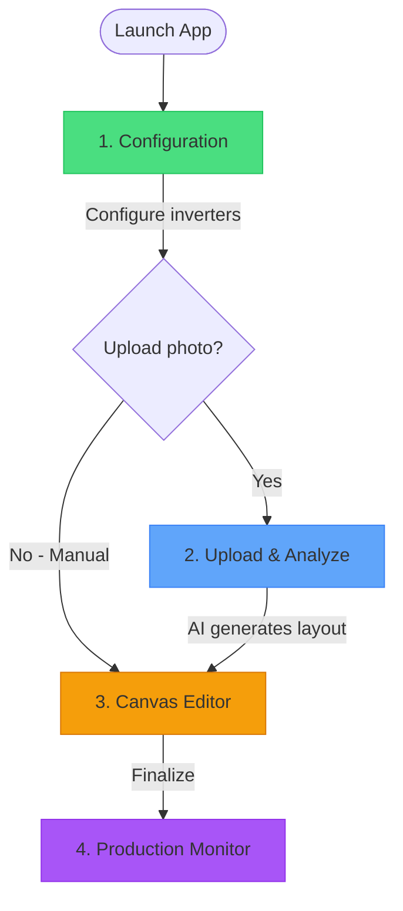

# Solar Panel Array Layout

A React Native (Expo) mobile application for creating and managing solar panel array layouts with micro inverter tracking.

## User Flow

The app guides you through a wizard to create and monitor your solar panel array:



### Step 1: Configuration (Required)

Start by configuring your micro-inverters:
- Add micro-inverters with their 8-digit serial numbers
- Set efficiency ratings (0-100%) for each inverter
- Configure default panel wattage

### Step 2: Upload (Optional)

Photograph your existing array for AI-powered layout generation:
- Take a photo or select from gallery
- AI analyzes the image to detect panel positions
- Automatically matches panel labels to inverter serial numbers
- Skip this step to create a layout manually

### Step 3: Canvas Editor (Required)

Create or confirm your panel layout:
- **From Upload**: Review AI-generated layout, make adjustments
- **Manual**: Add panels, arrange them on the canvas
- Link each panel to its micro-inverter
- Drag to reposition, rotate panels, use grid snapping
- Zoom in/out (3 levels) to view large arrays on smaller screens

### Step 4: Production Monitor

View real-time power production (read-only):
- Same canvas view as editor, but no editing allowed
- Each panel displays current wattage output
- Production updates every second
- Based on inverter efficiency × panel wattage

---

## Technical Architecture

### Canvas & Interactions

| Library | Purpose |
|---------|---------|
| [React Native Skia](https://shopify.github.io/react-native-skia/) | High-performance 2D graphics rendering for the canvas |
| [React Native Gesture Handler](https://docs.swmansion.com/react-native-gesture-handler/) | Touch gestures for drag, tap, and pan interactions |
| [React Native Reanimated](https://docs.swmansion.com/react-native-reanimated/) | Smooth 60fps animations and gesture-driven motion |

#### Canvas Implementation

The custom canvas is built with:

- **SolarPanelCanvas** - Main canvas component with gesture handling
- **SolarPanel** - Individual panel rendering with rotation support
- **usePanelsManager** - State management hook for panel CRUD operations
- **Collision utilities** - AABB collision detection with gap enforcement
- **Grid snapping** - 30px grid alignment on gesture end

### AI / Image Processing

| Service | Purpose |
|---------|---------|
| [AWS Bedrock](https://aws.amazon.com/bedrock/) | Hosts the AI model that analyzes uploaded photos |

The AI agent processes uploaded images to:

1. Detect solar panel positions and boundaries
2. Read barcode/QR code stickers
3. Extract micro inverter serial numbers
4. Output coordinate data and panel-to-inverter mappings

### Backend / API

| Technology | Purpose |
|------------|---------|
| [Expo API Routes](https://docs.expo.dev/router/reference/api-routes/) | Server-side endpoints within the Expo Router |
| [EAS Hosting](https://docs.expo.dev/eas/) | Secure deployment for API routes |

API routes handle:

- Secure communication with AWS Bedrock (keeping credentials server-side)
- Image upload and processing requests
- Simulation data retrieval

---

## Getting Started

### Prerequisites

- Node.js 18+
- [Bun](https://bun.sh/) (recommended) or npm
- Expo CLI
- iOS Simulator / Android Emulator or physical device

### Installation

```bash
# Clone the repository
git clone https://github.com/benjaminkomen/react-native-array-layout-2.git
cd react-native-array-layout-2

# Install dependencies
bun install

# Start the development server
bun start
```

### Running the App

```bash
# iOS
bun ios

# Android
bun android

# Web
bun web
```

---

## Project Structure

```
src/
├── app/
│   ├── _layout.tsx        # Root layout with PanelsProvider
│   ├── index.tsx          # Home screen with option cards
│   ├── config.tsx         # Step 1: Configuration (SwiftUI Form)
│   ├── upload.tsx         # Step 2: Upload & AI analysis
│   ├── custom.tsx         # Step 3: Canvas editor with toolbar
│   ├── production.tsx     # Step 4: Production monitor (TODO)
│   ├── link-inverter.tsx  # Modal: Link panel to inverter
│   └── api/
│       └── analyze+api.ts # Bedrock API route (Claude vision analysis)
├── components/
│   ├── OptionCard.tsx     # Home screen option cards
│   ├── ImagePreview.tsx   # Image preview component
│   ├── PermissionModal.tsx # Camera permission modal
│   ├── ProcessingOverlay.tsx # Fibonacci shader + shimmer text overlay
│   ├── SolarPanel.tsx     # Skia panel rendering with rotation
│   ├── SolarPanelCanvas.tsx # Main canvas with gesture handling
│   └── ZoomControls.tsx   # Floating zoom +/- controls
├── hooks/
│   ├── useConfigStore.ts  # Configuration store hook (inverters, wattage)
│   ├── useImagePicker.ts  # Camera and gallery picker hook
│   └── usePanelsManager.ts # Panel state management (CRUD)
└── utils/
    ├── analysisStore.ts   # Module-level store for passing analysis results
    ├── collision.ts       # AABB collision detection
    ├── configStore.ts     # Persistent config store (expo-sqlite/kv-store)
    ├── gridSnap.ts        # Grid snapping utilities
    ├── imageResize.ts     # Client-side image resize for upload
    ├── panelUtils.ts      # Panel dimensions, hit testing, positioning
    └── zoomConstants.ts   # Zoom level scale factors
terraform/
├── main.tf                # IAM user + Bedrock policy + S3 backend
├── variables.tf           # AWS region variable
├── outputs.tf             # Access key outputs
├── backend.hcl.example    # S3 backend config template
└── README.md              # Terraform setup instructions
```

---

## Roadmap

- [x] Implement camera capture and image picker
- [x] Build Skia canvas with draggable panels
- [x] Add collision detection with gap enforcement
- [x] Implement grid snapping (30px)
- [x] Add panel rotation (portrait/landscape)
- [x] Implement infinite canvas with viewport panning
- [x] Add snap-to-origin button
- [x] Add 3-level zoom controls for Custom and Production screens
- [x] Add processing overlay with fibonacci shader animation
- [x] Integrate AWS Bedrock for image analysis (Claude Sonnet 4.5)
- [x] Set up Expo API route for server-side Bedrock calls
- [x] Add Terraform config for IAM resources
- [x] Add configuration screen with micro-inverter management
- [ ] Implement production monitor screen
  - View-only canvas showing panel layout
  - Real-time wattage display per panel
  - Mock data: efficiency × wattage with fluctuation
- [ ] Deploy API routes to EAS Hosting
- [ ] Implement compass orientation indicator
- [ ] Create panel detail bottom sheet

---

## License

MIT
