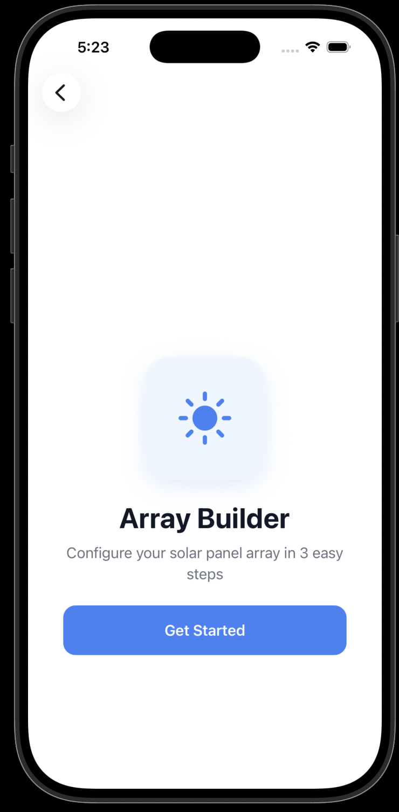
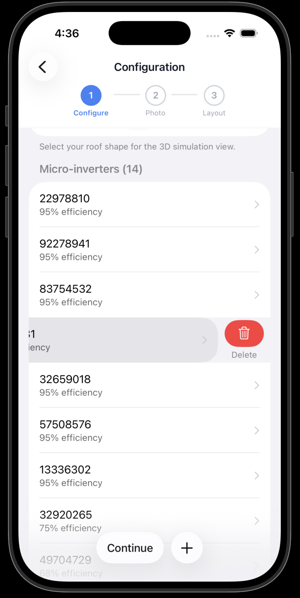
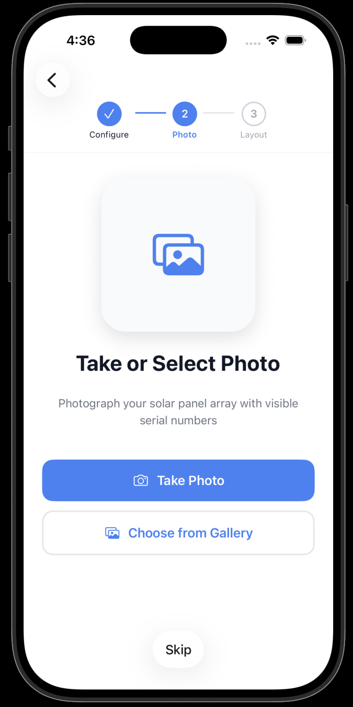
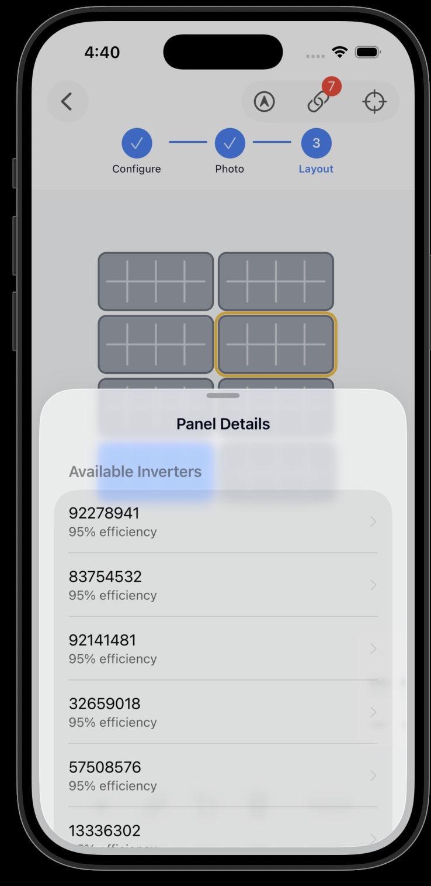
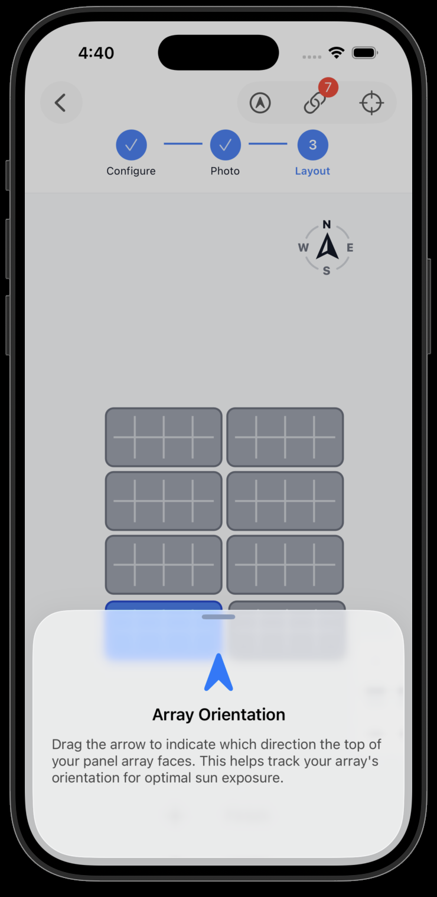
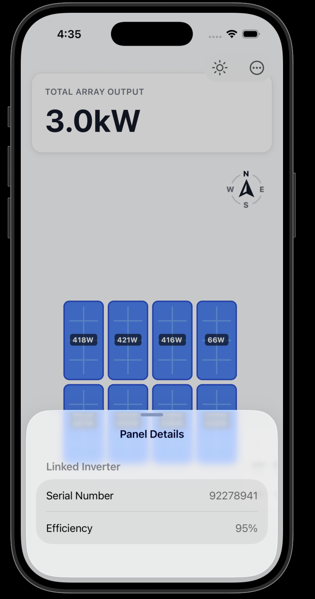

# Solar Array Simulator

A React Native (Expo) mobile application, used as a playground to design a solar panel array and simulate energy
production.

Download the app from TestFlight here: @todo add link

## Demo

## References / credits

- I was inspired by [this tweet](https://x.com/S0LARIN/status/2019390494028320794?s=20) to use some
  of [Expo SDK 55](https://expo.dev/changelog/sdk-55-beta)'s new features. Also, Beto did a good
  job [explaining](https://codewithbeto.dev/blog/expo-router-feats-ios-26) some of the new iOS 26 features
- I used
  this [open source](https://github.com/enzomanuelmangano/demos/blob/main/src/animations/fibonacci-shader-grid/index.tsx) [fibonacci shader grid](https://reactiive.io/demos/fibonacci-shader-grid)

## License

MIT
